<p align="center">
  
</p>

<p align="center">
  
</p>

<p align="center">
  <a href="https://tryhackme.com/p/kr4k3nby735"></a>
  <a href="https://profile.hackthebox.com/profile/019c6c73-88fa-7258-8ad1-e30a59c03cf4"></a>
</p>

<p align="center"></p>

## `whoami`

```text
Anant Awasthi
├── CSE (AI) Student
├── Offensive Security
├── Web & Network Pentesting
├── CTF Player
└── Linux Ricer
```

I'm a **Computer Science (AI) student** focused on **offensive security and web security**.

I like understanding systems by breaking them in controlled environments, solving difficult CTFs, and learning how attackers think.

- 🛡️ Web & Network Penetration Testing
- 🚩 CTFs & Offensive Security
- 🏢 Active Directory & Internal Network Security
- 🎨 Ricing, customizing and building custom UIs on Linux
- 🐧 Arch Linux enthusiast
- 🤖 AI/ML applied to security

> `learn → break → understand → build`

<p align="center"></p>

## ⚔️ Security Focus

| 🔴 Offensive Security | 🌐 Web Security | 🏢 Internal Security |
| :-------------------: | :-------------: | :------------------: |
| Red Teaming | Reconnaissance | Active Directory |
| Network Pentesting | Authentication | Windows Domains |
| Privilege Escalation | Access Control | Lateral Movement |
| Attack Paths | SSRF / XSS / SQLi | Kerberos |
| Post-Exploitation | File & Request Attacks | Domain Enumeration |

<p align="center"></p>

## 🧠 Currently Sharpening

<p align="center">
  
</p>

<p align="center"></p>

## 🧰 Toolbox

<p align="center">
  
</p>

<p align="center"></p>

## 🐧 Environment

<p align="center">
  
  
  
  
  
</p>

```text
  ╭─────────────────────────────────────────╮
  │  os       Arch Linux                    │
  │  wm       Hyprland (Wayland)            │
  │  shell    Zsh                           │
  │  theme    custom colors · blur · motion │
  │  hobby    ricing · theming · custom UI  │
  ╰─────────────────────────────────────────╯
```

| 🎨 Ricing | 🖥️ Displays | 🧩 UI |
| :-------: | :---------: | :---: |
| Dotfiles & configs | Custom layouts | Custom widgets |
| Color schemes & themes | Multi-monitor setups | Animations & blur |
| Fonts & icons | Wallpapers & lockscreens | Menus & notifications |

I enjoy building and maintaining my own Linux environment, tweaking every detail of the desktop, and keeping my workflow close to the terminal.

<!-- Add rice screenshots here, e.g.
<p align="center">
  
  
</p>
-->

<p align="center"></p>

<p align="center"><code>攻撃を理解するには、まず仕組みを理解する。</code></p>


