<p align="center">
  
</p>

<p align="center">
  <a href="https://tryhackme.com/p/kr4k3nby735"></a>
  <a href="https://profile.hackthebox.com/profile/019c6c73-88fa-7258-8ad1-e30a59c03cf4"></a>
  
</p>

<p align="center"></p>

## `whoami`

```text
Anant Awasthi
├── CSE (AI) Student
├── Offensive Security
├── Web Lead @ VOID Society
├── CTF Player
└── Security Tooling
```

I'm a **Computer Science (AI) student** focused on **offensive security and web security**.

I like understanding systems by breaking them in controlled environments, solving difficult CTFs, and building tools that make security workflows faster and more practical.

- 🌐 **Web Lead — VOID Society**
- 🛡️ Web & Network Penetration Testing
- 🚩 CTFs & Offensive Security
- 🏢 Active Directory & Internal Network Security
- 🧰 Security Tooling & Automation
- 🐧 Arch Linux enthusiast
- 🤖 AI/ML applied to automation and security

> `learn → break → understand → build`

<p align="center"></p>

## ⚔️ Security Focus

| 🔴 Offensive Security | 🌐 Web Security | 🏢 Internal Security |
| :-------------------: | :-------------: | :------------------: |
| Red Teaming | Reconnaissance | Active Directory |
| Network Pentesting | Authentication | Windows Domains |
| Privilege Escalation | Access Control | Lateral Movement |
| Attack Paths | SSRF / XSS / SQLi | Kerberos |
| Post-Exploitation | File & Request Attacks | Domain Enumeration |

<p align="center"></p>

## 🧠 Currently Sharpening

<p align="center">
  
</p>

<p align="center"></p>

## 🧰 Toolbox

<p align="center">
  
</p>

<p align="center"></p>

## 🌐 VOID Society

**Web Lead @ VOID Society**

Working around:

`Web Security` · `CTFs` · `Security Labs` · `Offensive Tooling` · `Red Teaming` · `Internal Security`

<p align="center"></p>

## 🐧 Environment

<p align="center">
  
  
  
  
</p>

I enjoy building and maintaining my own Linux environment and keeping my workflow close to the terminal.

<p align="center">
  
</p>


