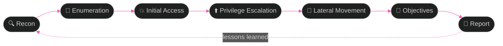

<!-- ═══════════════════════════════════════════════════════════
     KR4K3N · Anant Awasthi · profile README
     Repo name must be: Anant-Chill-Guy/Anant-Chill-Guy
     Files needed: README.md, assets/header.svg, assets/divider.svg,
                   .github/workflows/snake.yml
     ═══════════════════════════════════════════════════════════ -->

<p align="center">
  
</p>

<p align="center">
  
</p>

<p align="center">
  <a href="https://tryhackme.com/p/kr4k3nby735"></a>
  <a href="https://profile.hackthebox.com/profile/019c6c73-88fa-7258-8ad1-e30a59c03cf4"></a>
  <a href="https://github.com/Anant-Chill-Guy"></a>
  
</p>

<p align="center"></p>

## `~/whoami`

<table>
<tr>
<td width="56%" valign="top">

```ansi
┌──(kr4k3n㉿arch)-[~]
└─$ cat about.txt

  name      : Anant Awasthi
  alias     : KR4K3N
  role      : CSE (AI) student
  focus     : offensive security
  stack     : web · network · active directory
  habitat   : Arch Linux + Hyprland
  hobbies   : CTFs · ricing · custom UIs
  mantra    : learn → break → understand → build

┌──(kr4k3n㉿arch)-[~]
└─$ █
```

</td>
<td width="44%" valign="top">

I'm a **Computer Science (AI)** student obsessed with **offensive security**.

I like understanding systems by **breaking them in controlled environments**, grinding hard CTFs, and learning how attackers think so I can build better defenses.

🛡️ Web & network pentesting
🚩 CTFs & red teaming
🏢 Active Directory attack paths
🤖 AI/ML applied to security
🐧 Ricing Arch like it's a sport

</td>
</tr>
</table>

<p align="center"></p>

## ⚔️ Security Focus

<div align="center">

| 🔴 Offensive Security | 🌐 Web Security | 🏢 Internal Security |
| :-------------------: | :-------------: | :------------------: |
| Red Teaming | Reconnaissance | Active Directory |
| Network Pentesting | Authentication | Windows Domains |
| Privilege Escalation | Access Control | Lateral Movement |
| Attack Paths | SSRF · XSS · SQLi | Kerberos |
| Post-Exploitation | File & Request Attacks | Domain Enumeration |

</div>

### 🗺️ My Methodology



<p align="center"></p>

## 🧠 Currently Sharpening

```text
 web pentesting      ████████████░░░░░░░░   exploitation & methodology
 network pentesting  ███████████░░░░░░░░░   enumeration & attack paths
 active directory    ████████░░░░░░░░░░░░   domains & lateral movement
 red teaming         ███████░░░░░░░░░░░░░   end-to-end attack chains
 ctf (jeopardy)      █████████████░░░░░░░   web · pwn · crypto · forensics
```

### 🛣️ Roadmap

- [x] Linux fundamentals & Arch daily-driver
- [x] Web vulns: SQLi, XSS, SSRF, auth & access control
- [x] Network enumeration & service exploitation
- [ ] Active Directory: Kerberos attacks, ACL abuse, domain takeover
- [ ] Red team tradecraft: C2, evasion, OPSEC
- [ ] Binary exploitation & reverse engineering
- [ ] Write-ups for every solved box and challenge
- [ ] Industry certification (OSCP-style path)

<p align="center"></p>

## 🧰 Arsenal

<p align="center"><b>Languages & Systems</b></p>
<p align="center">
  
</p>

<p align="center"><b>Offensive Tooling</b></p>
<p align="center">
  
  
  
  
  
</p>
<p align="center">
  
  
  
  
  
  
</p>

<details>
<summary><b>🔎 What I use each tool for</b></summary>
<br>

<div align="center">

| Phase | Tools |
| :---: | :---: |
| Recon & scanning | Nmap · ffuf · Gobuster |
| Web testing | Burp Suite · custom Python scripts |
| Traffic analysis | Wireshark |
| AD enumeration | BloodHound · NetExec · Impacket |
| Cracking | Hashcat |
| Exploitation | Metasploit · manual PoCs |

</div>

</details>

<p align="center"></p>

## 🐧 Environment

<p align="center">
  
  
  
  
  
</p>

```text
  ╭─────────────────────────────────────────╮
  │  os       Arch Linux                    │
  │  wm       Hyprland (Wayland)            │
  │  shell    Zsh                           │
  │  theme    custom colors · blur · motion │
  │  hobby    ricing · theming · custom UI  │
  ╰─────────────────────────────────────────╯
```

<div align="center">

| 🎨 Ricing | 🖥️ Displays | 🧩 UI |
| :-------: | :---------: | :---: |
| Dotfiles & configs | Custom layouts | Custom widgets |
| Color schemes & themes | Multi-monitor setups | Animations & blur |
| Fonts & icons | Wallpapers & lockscreens | Menus & notifications |

</div>

<details>
<summary><b>📸 Rice gallery (click to expand)</b></summary>
<br>

<!-- Add screenshots to assets/ then uncomment:
<p align="center">
  
  
</p>
-->

<p align="center"><i>screenshots coming soon…</i></p>

</details>

<p align="center"></p>

## 📊 GitHub Stats

<p align="center">
  
  
</p>

<p align="center">
  
</p>

<p align="center">
  
</p>

<p align="center">
  
</p>

<p align="center">
  
</p>

<p align="center"></p>

## 🚀 Featured Projects

<!-- Replace REPO_NAME with real repo names to show pinned cards -->
<p align="center">
  <a href="https://github.com/Anant-Chill-Guy/REPO_NAME"></a>
  <a href="https://github.com/Anant-Chill-Guy/REPO_NAME_2"></a>
</p>

<p align="center"></p>

## 🚩 Hunting Grounds

<div align="center">

| Platform | Focus | Profile |
| :------: | :---: | :-----: |
| **TryHackMe** | Guided rooms, AD & web paths | [kr4k3nby735](https://tryhackme.com/p/kr4k3nby735) |
| **Hack The Box** | Boxes, labs, real attack chains | [Profile](https://profile.hackthebox.com/profile/019c6c73-88fa-7258-8ad1-e30a59c03cf4) |

</div>

<p align="center">
  <sub>⚠️ All offensive work is done on authorized targets: labs, CTFs, and systems I have permission to test.</sub>
</p>

<p align="center"></p>

## 🤝 Let's Connect

<p align="center">
  <a href="https://github.com/Anant-Chill-Guy"></a>
  <a href="https://tryhackme.com/p/kr4k3nby735"></a>
</p>

<p align="center"><sub>Open to collaborating on CTF teams, security tooling, and Linux UI projects.</sub></p>

<p align="center"></p>

<p align="center"><code>攻撃を理解するには、まず仕組みを理解する。</code></p>
<p align="center"><sub><i>"To understand the attack, first understand the system."</i></sub></p>

<p align="center">
  
</p>
